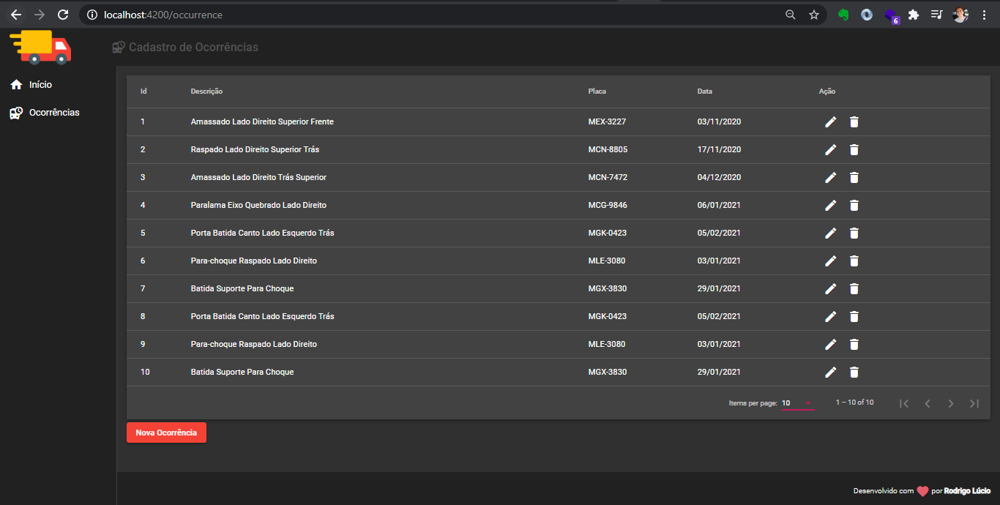

<h1 align="center">
    
</h1>

## 💻 Projeto

Front-end do projeto desenvolvido durante o curso Angular 9 - Essencial da [COD3R](https://github.com/cod3rcursos).

Utilizado [Angular CLI](https://github.com/angular/angular-cli) versão 10.0.1.

## :rocket: Tecnologias

Neste projeto foram utilizadas as seguintes tecnologias:

- [Angular](https://angular.io/)
- Biblioteca de componentes [Angular Material](https://material.angular.io/)
- Back-end com [JSON Server](https://www.npmjs.com/package/json-server)

## ▶️ Utilização

Dentro da pasta do projeto, execute o comando `npm install` para instalar as todas as dependências necessárias.

Após isso, execute o comando `ng serve` para iniciar a aplicação.

A projeto estará rodando em `http://localhost:4200`.

